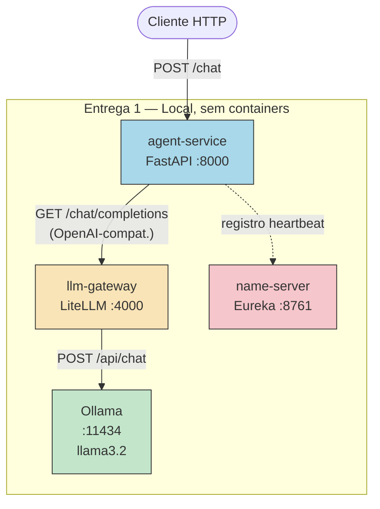

# Diagrama de Arquitetura — Entrega 1 (Fundação)



## Fluxo de uma requisição

1. Cliente envia `POST /chat` com `{ "message": "...", "session_id": "abc" }`
2. `agent-service` monta o histórico da sessão e chama o LLM Gateway
3. `llm-gateway` (LiteLLM) roteia para Ollama com o modelo configurado
4. Ollama retorna a completion; se houver `tool_calls`, o agent executa a ferramenta localmente e reitera
5. Resposta final é devolvida ao cliente e o histórico é atualizado em memória

## Protocolos

| Origem | Destino | Protocolo |
|--------|---------|-----------|
| cliente | agent-service | REST/HTTP |
| agent-service | llm-gateway | REST/HTTP (OpenAI-compatible) |
| llm-gateway | Ollama | REST/HTTP |
| agent-service | name-server | REST/HTTP (Eureka heartbeat) |
```
